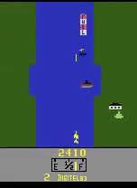

# Chapter 6: Implementing an Intelligent Agent for Optimal Control using Deep Q Learning

1. [Brief chapter summary and outline of topics covered](#1-brief-chapter-summary-and-outliine-of-topics-covered)
2. [Code structure](#2-code-structure)
3. [Running the code](#3-running-the-code)
   - [Training](#training)
   - [Testing](#testing)

## 1. Brief chapter summary and outline of topics covered
Chapter 6 covers various methods to improve Q-learning including action-value function approximation using deep neural network, experience replay, target networks and also the necessary utilities and building-blocks that are useful for training and testing deep reinforcement learning agents in general. You will implement a DQN based intelligent agent for taking optimal discrete control actions and train it to play several Atari games and watch the agent's performance.

The following is an outline of the higher-level topics covered in this chapter:
* Various methods to improve the Q-learning agent, including the following:
    * Neural network approximation of action-value functions
    * Double DQN
    * Experience replay
    * Exploration schedules
* Implementing deep convolutional neural networks using PyTorch for action-value function approximation
* Stabilizing deep Q-networks using target networks
* Logging and monitoring learning performance of PyTorch agents using TensorBoard
* Managing parameters and configurations
* Atari Gym environment
* Training deep Q-learners to play Atari games

## 2. Code structure
       
* [deep_Q_learner.py](./deep_Q_learner.py)  ──> Main script to launch the Deep Q Learning agent
 * [environment](./environment)  ──> Module containing environment wrappers and utility functions
   * [atari.py](./environment/atari.py)  ──> Wrappers for preprocessing Atari Gym environment
   * [\_\_init__.py](./environment/__init__.py)  
   * [utils.py](./environment/utils.py)  ──>  Environment utility functions to resize, reshape observations using OpenCV
 * [function_approximator](./function_approximator)  ──> Module with neural network implementations
   * [cnn.py](./function_approximator/cnn.py)  ──> Three-layer CNN implementation using PyTorch
   * [\_\_init__.py](./function_approximator/__init__.py)  
   * [perceptron.py](./function_approximator/perceptron.py)  ──>Two-layer feed-forward neural network implementation using PyTorch
 * [logs](./logs)  ──> Folder to contain the Tensorboard log files for each run
 * [parameters.json](./parameters.json)  ──> Configuration parameters for the Agent and the environment
 * [README.md](./README.md)
 * [trained_models](./trained_models)  ──> Folder containing trained-models/"brains" for the agent
 * [utils](./utils)  ──>  Module containing utility functions used to train the agent
     * [decay_schedule.py](./utils/decay_schedule.py)  ──> Decay schedules used by the $$\epsilon-greedy$$  policy
     * [experience_memory.py](./utils/experience_memory.py)  ──> Experience Replace memory implementation
     * [params_manager.py](./utils/params_manager.py)  ──> A simple class to manage the agent's and environment's parameters
     * [weights_initializer.py](./utils/weights_initializer.py)  ──> Xavier Glorot weights initialization method
## 3. Running the code

The [deep_Q_learner.py](./deep_Q_learner.py) is the main script that takes care of training and testing depending on the script's arguments. The table below summarizes the arguments that the script supports and what they mean. Note that, most of the agent and environment related configuration parameters are in the [parameters.json](parameters.json) file and only the few parameters that are more useful when launching the training/testing scripts are made available through the command line arguments.

| Argument                 | Description                                                  |
| ------------------------ | ------------------------------------------------------------ |
| `--params-file`          | Path to the JSON parameters file. Default=`parameters.json`  |
| `--env`                  | Name/ID of the Atari environment available in OpenAI Gym. Default=`SeaquestNoFrameskip-v4` |
| `--gpu-id`               | ID of the GPU device to be used. Default=`0`                 |
| `--render`               | Render the environment to screen. Off by default             |
| `--test`                 | Run the script in test mode. Learning will be disabled. Off by default |
| `--record`               | Enable recording (Video & stats) of the agent's performance  |
| `--recording-output-dir` | Directory to store the recordings (video & stats). Default=`./trained_models/results` |

- ### Training

  Make sure the `rl_gym_book` conda environment with the necessary packages installed is activated. Assuming that you cloned the code as per the instructions to `~/HOIAWOG/`,  you can launch the Agent training script from the `~/HOIAWOG/ch6` directory using the following command:

  `python deep_Q_learner.py --env RiverraidNoFrameskip-v4 --gpu-id 0` 

   The above command will start training the agent for the Riverraid Atari game (`RiverraidNoFrameskip-v4`) . If a saved agent "brain" (trained model) is available for the chosen environment, the training script will upload that brain to the agent and continue training the agent to improve further.

  The training will run until `max_training_steps` is reached, which is specified in the [parameters.json](./parameters.json) file. There are several other parameters that can be configured using the [parameters.json](./parameters.json)  and it is recommended to adjust them based on the capabilities of the hardware you are running on. You can set `use_cuda` to `false` if you are running on a machine without a GPU.

  The log files are written to the directory pointed with the `summary_file_path_prefix` parameter (the default is `logs/DQL_*`). When the training script is running, you can monitor the learning progress of the agent visually using Tensorboard. From the `~/HOIAWOG/ch6` directory, you can launch Tensorboard with the following command: `tensorboard --log_dir=./logs/`. You can then visit the web URL printed on the console (the default one is: http://localhost:6006) to monitor the progress.

- ### Testing

  `python deep_Q_learner.py --env RiverraidNoFrameskip-v4 --test --render  --record`
  
  The above command should launch the Deep Q Learning Agent in test mode and render the environment states while also recording the performances. You can find the stats and the recording in the [trained_models/results](trained_models/results) directory after the script finishes running. Sample output for the agent trained on `RiverraidNoFrameskip-v4` for a few thousand episode is shown below:
  
  
